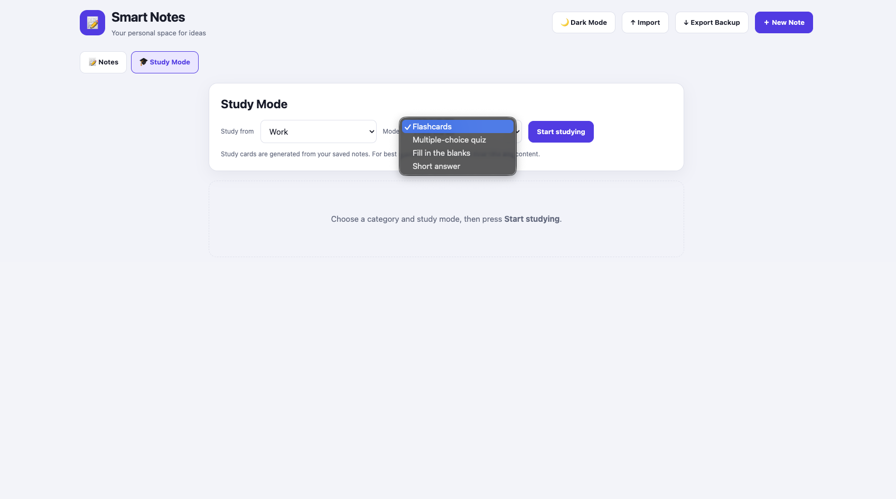
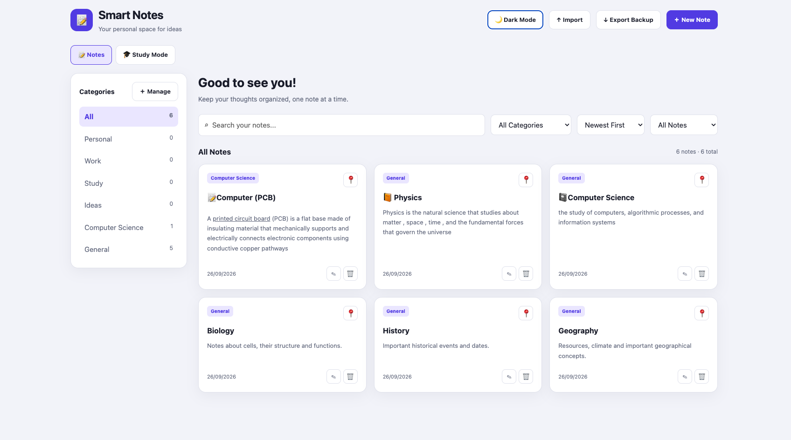

# Smart Notes

Smart Notes is a web-based note-taking application which is designed to help users create , organise , edit and manage their notes in one place.With features like pinned notes, categories, text editing , study mode and import and export feature it helps in organising information and reviewing notes way more easy and efficient.

---
## Description
- Smart Notes has many features to help the users such as create, edit, and delete notes feature improving usability.Users can pin important notes to keep them easily accessible.They can also organise notes using categories and save notes for future access.We also have category based organisation also users can search notes by keywords and filter notes by category, they can sort notes to find information easily.Users can view these notes in an organised dashboard.I have also added customisation features like switching between dark mode and light mode this helps the users to use the application with the theme of their choice. The application has a clean and organised ui for easy use and understanding .And one of the most important feature "Study Notes".Study Mode helps users revise information from their saved notes and helps them to test their knowledge or what they have learned.Users can test there knowledge with questions which are in 4 types 
Flashcards ,Multiple-choice quizzes ,Fill-in-the-blanks ,Short-answer questions.And there is another important features of SMART NOTES that is import and export notes where with ,Import notes users can easily import there notes that they want to add and also make backup of there notes for future use with the EXPORT FEATURE.I have also added some text editing features for the users to highlight the important text in there notes they can add heading , make lists and many more features such as bold, italic, underline etc.This helps n structuring notes for better readability.
---

## Screenshots

### Dashboard — Dark Mode


### Create a New Note


### Study Mode



### Dashboard — Light Mode



---

### Live Website

You can use Smart Notes directly in your web browser without installing anything.

1. Visit the [Smart Notes website](https://willbettleheim.github.io/Smart-Notes/).
2. You can start by creating new using the "new note" button as you can see in the screenshots and u can also import your notes if already have some and later test yourself with study notes feature.

### Running Locally

#### Prerequisites

- Node.js
- npm
- A modern web browser
- Git (optional, for cloning the repository)

#### Installation

1. Clone the repository:

```bash
git clone https://github.com/willbettleheim/Smart-Notes.git
```

2. Navigate to the project directory:

```bash
cd Smart-Notes
```

3. Install the dependencies:

```bash
npm install
```

#### Executing the Program

Start the development server:

```bash
npm run dev
```

Now open the local URL displayed in your terminal to access the application.

---

##  Built With

Smart Notes is a web-based application.You can find the exact technologies and dependencies in projects source code and package configuration. 

---

## Help

If you encounter any issues with Smart Notes:

- Make sure Node.js and npm are installed if you are running the project locally.
- Ensure all project dependencies have been installed.
- Check the terminal for any error messages.
- Make sure you are running the commands from the project directory.

For additional assistance, you can open an issue in the GitHub repository.

---

##  License

## License

Smart Notes is licensed under the [MIT License](./LICENSE).
You are free to use, copy, modify, merge, publish, distribute, sublicense, and sell copies of the software, subject to the terms of the MIT License.
See the [LICENSE](./LICENSE) file for the complete license text.
