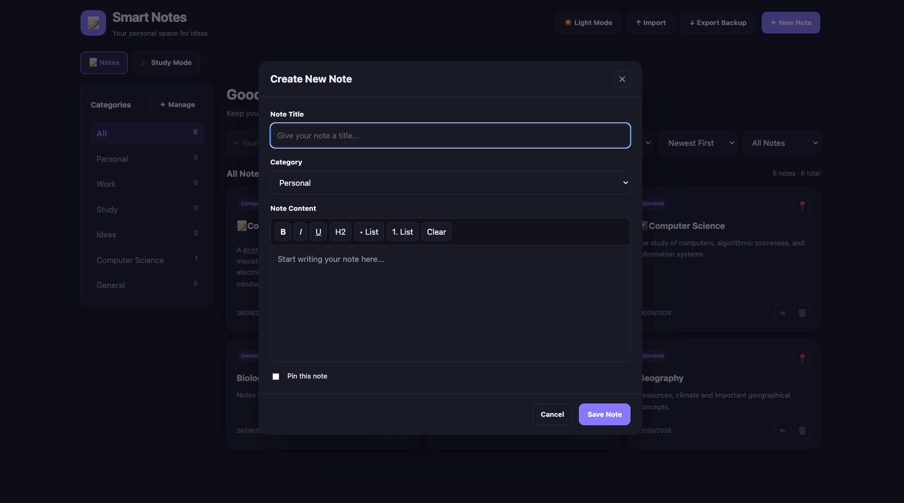

# 📝 Smart Notes

Smart Notes is a web-based note-taking application designed to help users create, organize, edit, and manage their notes in one place. With features like pinned notes, categories, rich-text editing, and Study Mode, it makes organizing information and reviewing notes simple and convenient.

🌐 **Live Website:** [Open Smart Notes](https://willbettleheim.github.io/Smart-Notes/)

---

## ✨ Features

### 📝 Note Management
- Create, edit, and delete notes.
- Pin important notes to keep them easily accessible.
- Organize notes using categories.
- Save notes for future access.

### 🔍 Search and Organization
- Search notes by keywords.
- Filter notes by category.
- Sort notes to find information easily.
- View notes in an organized dashboard.

### 🎨 Customization
- Switch between dark mode and light mode.
- Use a clean and simple interface designed for easy navigation.

### 📚 Study Mode
Study Mode helps users revise information from their saved notes.

Available study methods include:
- Flashcards
- Multiple-choice quizzes
- Fill-in-the-blanks
- Short-answer questions

Choose a category and study method to begin reviewing your notes.

### 💾 Import and Export
- Import notes using the available import feature.
- Export notes for backup and future use.
- Manage your notes conveniently.

### ✍️ Rich-Text Editor
- Format text using bold, italic, and underline.
- Add headings and lists.
- Structure your notes for better readability.

---

## 📸 Screenshots

### Dashboard — Dark Mode


### Create a New Note



### Study Mode


### Dashboard — Light Mode


---

## 🚀 Getting Started

### 🌐 Using the Live Website

You can use Smart Notes directly in your browser without installing anything.

1. Visit the [Smart Notes website](https://willbettleheim.github.io/Smart-Notes/).
2. Click the **+ New Note** button to create a note.
3. Enter a title, choose a category, and write your content.
4. Save your note and manage it from the dashboard.
5. Use Study Mode to revise your saved notes.

### 💻 Running Locally

#### Prerequisites

- Node.js
- npm
- A modern web browser
- Git (optional, for cloning the repository)

#### Installation

1. Clone the repository:

```bash
git clone https://github.com/willbettleheim/Smart-Notes.git
```

2. Navigate to the project directory:

```bash
cd Smart-Notes
```

3. Install the dependencies:

```bash
npm install
```

#### Executing the Program

Start the development server:

```bash
npm run dev
```

Open the local URL displayed in your terminal to access the application.

---

## 🛠️ Built With

Smart Notes is a web-based application. The exact technologies and dependencies can be found in the project's source code and package configuration.

---

## ❓ Help

If you encounter any issues:

- Make sure Node.js and npm are installed if running the project locally.
- Ensure all project dependencies have been installed.
- Check the terminal for error messages.
- Make sure you are running commands from the project directory.

For additional assistance, open an issue in the GitHub repository.

---

## 📄 License

Please refer to the repository's LICENSE file, if available, for the applicable licensing terms.
